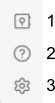
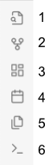
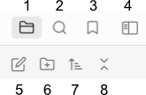
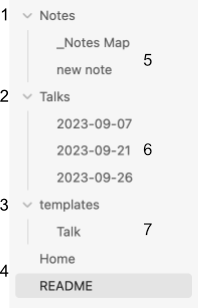
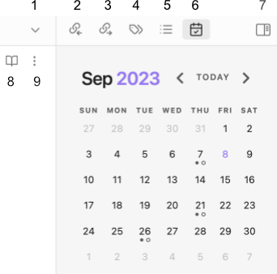
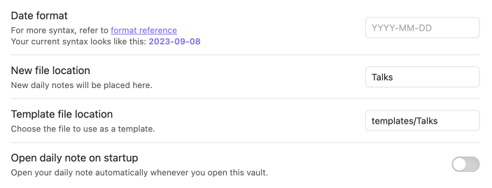

# Obsidian notes
[Obsidian](https://obsidian.md/) is a powerful markdown editor app that is free used primarily for [Personal Knowledge Management](https://en.wikipedia.org/wiki/Personal_knowledge_management) or PKM. [Markdown](https://en.wikipedia.org/wiki/Markdown) is a lightweight markup language for creating formatted text using a plain-text editor. 

Here I show how to use Obsidian's "Daily Notes" functionality to set up a simple system to plan and manage calendar-based events. My example will be to manage my speaking engagements.

To get started watch these tutorials by Nick Milo:
1. https://www.youtube.com/watch?v=QgbLb6QCK88&t=3s
2. https://www.youtube.com/watch?v=bBk2kg8Gm_U

To use this folder as an Obsidian vault, you will need to add three Community Plugins:
- Calendar
- Dataview
- Tasks
## Installation and setup
1. Clone or download this Github repository from https://github.com/DrTomasAragon/obsidian. On your computer, a repository is just a folder.
2. Download and install Obsidian app from https://obsidian.md.
3. Go to Settings > Community Plugins > Browse
	1. Install and Enable `Calendar`, `Dataview`, and `Tasks` plugins
4. From Obsidian app, select "Open folder as vault"
That's it! You are good to go!
## Getting started
Go ahead and edit the files. I put an asterisk `(*)` below next to selections you may need to use for this vault.
### Bottom-left side
To install, enable, or update Community Plugins, select "Settings" (3). For this vault the Community Plugins were already installed and enabled.

1. Open another vault
2. Help
3. Settings*
### Top-left-side 
To create a today's date-based note, select "Open today's daily note" (4). In this vault it will create a note in the "Talks" folder.

1. Open quick switcher
2. Open graph view
3. Create new canvas
4. Open today's daily note*
5. Insert template
6. Open command palette
To create a date-based note for a date other than today, then select a date from the Calendar (see below). This creates a note in the "Talks" folder with the selected date.
### Top-left 
This section is for managing folders, files, and searches. You can also create a new note or folder. 

1. Files
2. Search
3. Bookmarks
4. Collapse
5. New note
6. New folder
7. Change sort order
8. Collapse all
### Top-left

- 1, 2, and 3 are folders.
- 4 (Home, README) are notes at the root of the folder.
- 5, 6, and 7 are notes in the Notes, Talks, and templates directories, respectively.
The `Home` note is a dashboard to summarize Talks planning and Tasks. To accomplish this I used the `Dataview` and `Tasks` Community Plugins.
### Top-right 

1. Open Notes Tab menu
2. Backlinks (mentions) to opened note
3. Outgoing links
4. Tags
5. Outline for opened note
6. Calendar*
7. Collapse
8. Toggle between Reading and Editing modes
9. Dropdown menu for opened note
To create a date-based note for a date other than to today, then select a date from the Calendar.
### Daily notes options
We are using the Daily notes function to create date-based notes in the "Talks" folder. To accomplish this, set the "New file location" field to the "Talks" folder.

Set the "Template file location" field to "templates/Talks" path. In other words, this means the `Talks.md` template file is located in the `templates` folder.
## Final thoughts
In this tutorial I took advantage of Obsidian's Daily Note function to plan and manage speaking engagements ("Talks"). We used the `Dataview` and `Tasks` Community Plugins.

Obsidian is best for setting up bottom-up, low friction processes for 
- Personal Knowledge Management
- Note making, including
	- meeting notes
	- literature notes
	- research notes
	- atomic notes, including the Zettelkasten method
- Connecting ideas and concepts to generate new insights.

To learn more, view YouTube tutorials from 
- [Nick Milo](https://www.youtube.com/@linkingyourthinking)
- [Nicole van der Hoeven](https://www.youtube.com/@nicolevdh)

